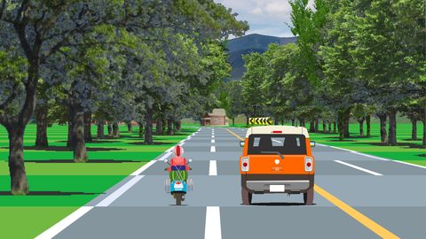
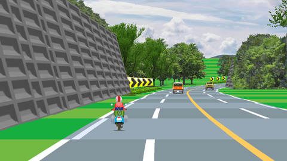
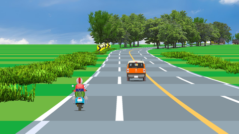
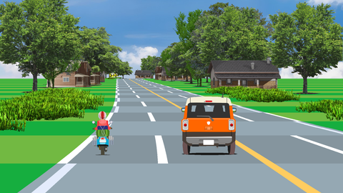

p3drdscr - pseudo 3D road screensaver
=====================================

Pseudo-3D road screensaver running on Windows.

Windowsで動作する疑似3D道路のスクリーンセーバー。

Table of Contents
-----------------

* [Description](#description)
* [Screenshots](#screenshots)
* [Environment](#environment)
* [Install](#install)
* [License](#license)
* [Author](#author)


Description
-----------

This is a pseudo-3D road screensaver for Windows made with HSP 3.7beta.

Windows用の疑似3D道路のスクリーンセーバーです。

* プログラミング環境 HSP 3.7beta で作成。
* Windows10 x64 22H2で動作確認。

Screenshots
-----------

[](./screenshots/sshot0001.png)

[](./screenshots/sshot0002.png)

[](./screenshots/sshot0003.png)

[](./screenshots/sshot0004.png)


Environment
-----------

* Windows10 x64 22H2
* HSP 3.7beta

   * [HSP3.7β7を公開しました - おにたま(オニオンソフト)のおぼえがき](https://www.onionsoft.net/wp/archives/3723)
   * [HSPダウンロード](https://hsp.tv/make/downlist.html)

### Hardware spec

#### example 1

* CPU : AMD Ryzen 5 5600X (3.7 - 4.6GHz, 6core/12thread, TDP 65W)
* RAM : 16GB
* GPU : GeForce GTX 1060 6GB
* Result 1 : 1280x720, 30FPS, zoom=2
* Result 2 : 1920x1080, 20FPS, zoom=2

#### example 2

* CPU : AMD Athlon 5350 Quad-Core (2.0GHz, 4core, TDP 25W, Jaguar Core)
* RAM : 4GB
* GPU : On-board (Radeon R3, GCN)
* Result : 480x270, 15FPS, zoom=2


Install
-------

The following two files can be used as a screen saver by copying them to the designated location. Please select "p3drdscr" as the screen saver name.

以下の2つのファイルを所定の場所にコピーすればスクリーンセーバとして利用できます。スクリーンセーバ名は、p3drdscr を選んでください。

```
p3drdscr.scr
p3drdscr.ini
```

Copy to

* Windows 64bit : C:\Windows\SysWOW64\
* Windows 32bit : C:\Windows\System32\

It can also be run as a demo program by running p3drdscr.exe.

または、p3drdscr.exe をデモプログラムとして実行できます。デモプログラムとして動かした場合は、以下のキー入力とコマンドラインオプションを受け付けます。

* A key : FPS display enable / disable.
* Z key : Change Virtual screen size.
* X key : Change framerate.
* C key Change zoom kind. (0. gzoom + gcopy -> 1. grotate -> 2. gsquare)
* Up, Down key : Speed Up / Down
* Left, Right key : Shift X position.
* Add command line option "/C" : Display config window.


License
-------

p3drdscr.hsp, tex.png : CC0 / Public Domain

bg.jpg, bg.png : [Pixabay](https://pixabay.com/ja/photos/%E9%A2%A8%E6%99%AF-%E3%83%90%E3%83%8D-%E5%A4%8F-%E3%82%A4%E3%83%B3%E3%82%B0%E3%83%A9%E3%83%B3%E3%83%89-215830/)


Author
------

[mieki256](https://github.com/mieki256)


References
----------

* [Creating a pseudo 3D racer](https://www.lexaloffle.com/bbs/?tid=35767)
* [Creating a pseudo 3D racer - part 2](https://www.lexaloffle.com/bbs/?tid=35824)
* [Creating a pseudo 3D racer - part 3](https://www.lexaloffle.com/bbs/?tid=35868)
* [How to build a racing game | Code inComplete](https://codeincomplete.com/articles/javascript-racer/)
* [How to build a racing game - straight roads | Code inComplete](https://codeincomplete.com/articles/javascript-racer-v1-straight/)
* [How to build a racing game - curves | Code inComplete](https://codeincomplete.com/articles/javascript-racer-v2-curves/)
* [How to build a racing game - hills | Code inComplete](https://codeincomplete.com/articles/javascript-racer-v3-hills/)
* [How to build a racing game - conclusion | Code inComplete](https://codeincomplete.com/articles/javascript-racer-v4-final/)
* [Javascript Racer - v4 (final)](https://codeincomplete.com/games/racer/)
* [Lou's Pseudo 3d Page](http://www.extentofthejam.com/pseudo/)
* [疑似3Dに関するメモ - サイバーグノーシス](https://seesaawiki.jp/mod_memo/d/%B5%BF%BB%F73D%A4%CB%B4%D8%A4%B9%A4%EB%A5%E1%A5%E2)

